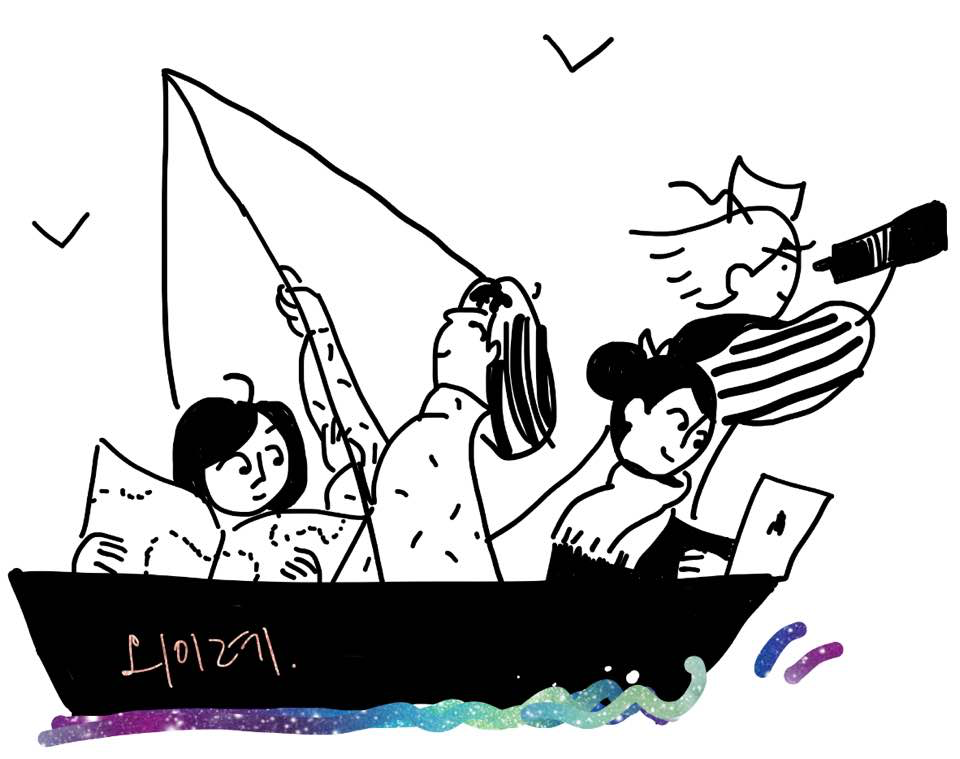

안녕하세요! 브런치 작가 외이례의 웹페이지에 오신 것을 환영합니다 :-)
[외이례의 브런치](https://brunch.co.kr/@whyrano)는 여기서 만나보실 수 있어요!

# 외이례? Whyrano?

## 우리는 누구?

### 프로젝트의 시작

외이례는 총 네 명의 작가로 구성이 되어있습니다. 서로 다른 환경에서 나고 자랐고, 지금은 접점이 없는 분야에 종사하고 있습니다. 평소 당연하게 생각되는 것들에 대해서 "왜 이럴까"하고 자주 질문을 던지던 사람 넷이 모여 다양한 시각으로 같은 문제를 바라보면 좋겠다는 마음으로 이 프로젝트를 시작하게 되었습니다.

### 우리가 원하는 방향

이렇게 네 명의 각자 다른 개인이 모여 같은 문제를 바라보면서, 머릿속에 있었던 복잡한 생각들이 술술 풀려가는 것을 느낄 수 있었습니다. 그에 더해, 같은 분야도 다른 각도로 바라볼 수 있다는 점을 배우게 되었습니다. 우리는 이와 같은 경험을 여러 사람과 공유하면 어떻겠냐는 결론에 이르렀습니다.

저희는 브런치에 생각을 시시콜콜, 또 쉽게 풀어두고자 합니다. 가끔은 쉽지만 유익한 정보통으로, 또 다른 글에서는 공감대를 형성할 수 있는 글로 생각을 풀어보고자 합니다. 이외에도 미처 생각해보지 못 한 부분을 자극할 수 있는 새로운 시야로도 여러분께 다가가고자 합니다.

## 발행하는 글의 주제

저희가 다루고자 하는 분야는 아래와 같이 총 네 가지입니다. 각각의 글은 각 주제의 내용을 요약할 수 있는 말머리와 함께 발행됩니다.

*   식소비문화 - 먹고사는게왜이래
*   복약정보 - 내가먹는약왜이래
*   소비문화 - 내돈쓰는데왜이래
*   미디어의 영향 - 편해졌는데왜이래

## 추가 페이지 정보 필요 : 이거 어떻게든 활용할거임 ㅋㅋ

[추가 페이지](./another-page.html).

## 작가와의 이야기가 필요하다면?

- whyrano.kr@daum.net
- [작가에게 제안하기](https://brunch.co.kr/@whyrano/propose)

### Definition lists can be used with HTML syntax.

<dl>
<dt>Name</dt>
<dd>Godzilla</dd>
<dt>Born</dt>
<dd>1952</dd>
<dt>Birthplace</dt>
<dd>Japan</dd>
<dt>Color</dt>
<dd>Green</dd>
</dl>
